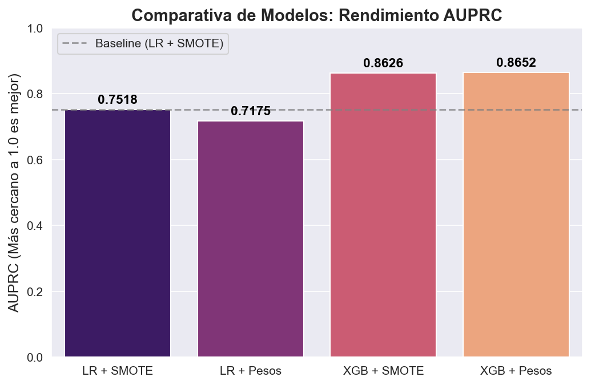
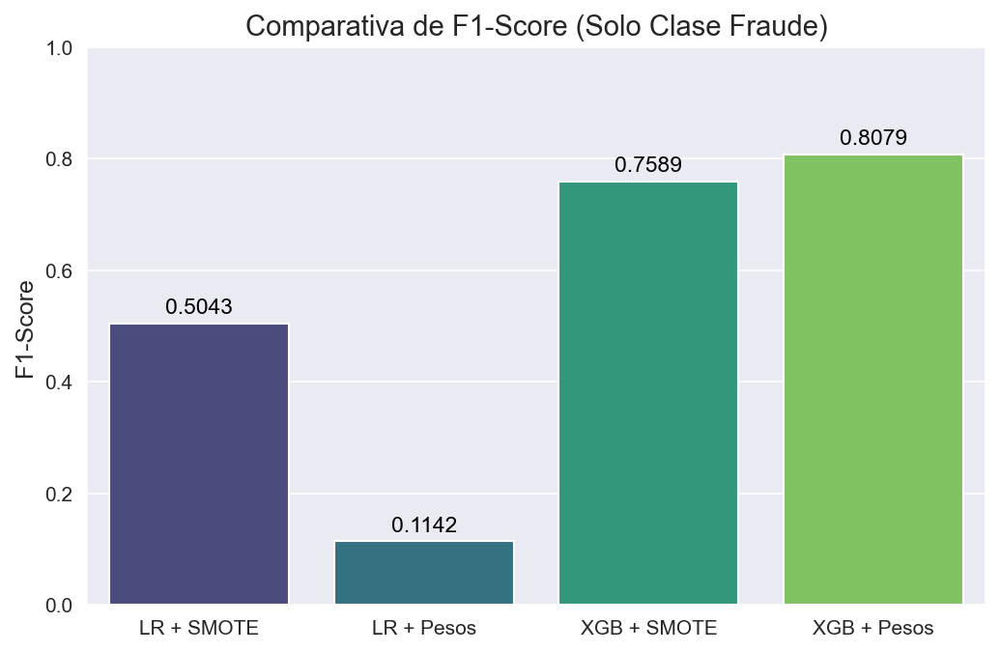
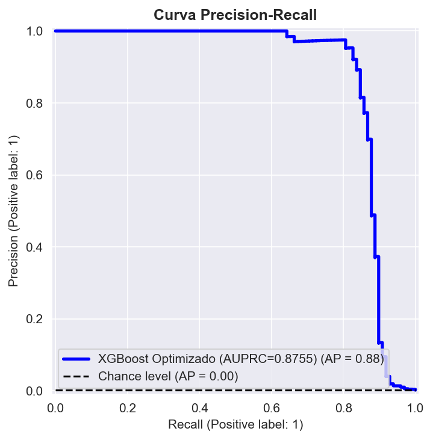
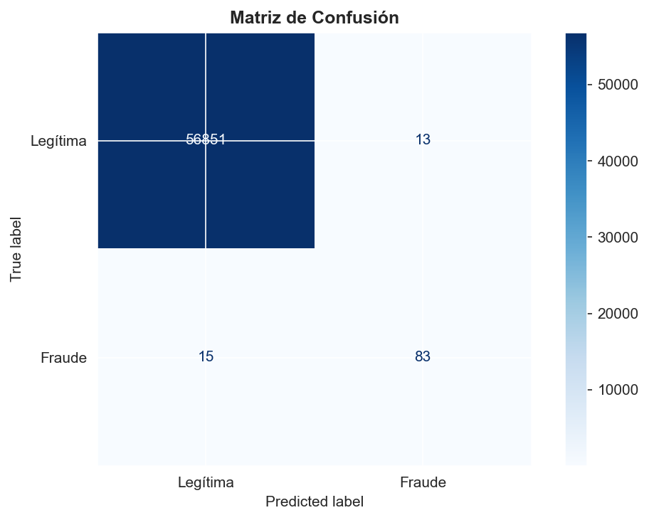

# Detección de Fraude Transaccional: Machine Learning en Escenarios de Desbalanceo Extremo

## Visión General del Proyecto
Este proyecto aborda la detección de transacciones fraudulentas con tarjetas de crédito, un desafío clásico pero complejo debido a la naturaleza extremadamente asimétrica de los datos. Aunque el dataset base proviene de un entorno controlado (Kaggle), la arquitectura de este proyecto fue diseñada para la prevención estricta de fuga de datos (Data Leakage), validación cruzada estratificada y selección de modelos basada en impacto de negocio (reducción de fricción al cliente).

---

## 1. Entendimiento de los Datos (Dataset)
Los datos utilizados corresponden al dataset público de detección de fraude en tarjetas de crédito de Kaggle. 

* **Volumen:** 284,807 transacciones en total.
* **Características (Features):** 30 variables predictoras. Por confidencialidad bancaria, las variables originales (V1 a V28) ya fueron transformadas mediante PCA (Análisis de Componentes Principales). Las únicas variables en su formato original son `Time` (segundos transcurridos) y `Amount` (monto de la transacción).
* **El Reto del Desbalanceo:** Solo 492 transacciones son fraudes reales. Esto representa apenas el **0.172%** de los datos.

---

## 2. Preprocesamiento de Datos (Pipeline)
Para preparar los datos antes de inyectarlos a los algoritmos, se diseñó un pipeline de transformación asegurando que no existiera contaminación entre el set de entrenamiento y prueba.

1. **Escalamiento Robusto:** Las variables transformadas por PCA ya estaban escaladas, pero `Time` y `Amount` no. Dado que las transacciones financieras tienen valores atípicos extremos (compras muy grandes), se utilizó `RobustScaler` de Scikit-Learn, el cual utiliza la mediana y el rango intercuartílico, volviéndose inmune a los *outliers*.
2. **Data Splitting:** Se dividió el dataset en 80% entrenamiento y 20% prueba utilizando partición estratificada (`stratify=y`) para garantizar que ese crítico 0.17% de fraudes se distribuyera equitativamente en ambos sets.
3. **Persistencia:** Los DataFrames preprocesados y el escalador fueron guardados en formato `.pkl` para modularizar el proyecto y separar la ingeniería de características del entrenamiento.

---

## 3. Fase de Benchmarking y Estrategias de Balanceo
Se evaluó la capacidad predictiva de modelos lineales (Regresión Logística) frente a modelos de ensamble basados en árboles (XGBoost). El objetivo principal fue contrastar dos metodologías para manejar el desbalanceo masivo:

* **Balanceo Sintético (SMOTETomek):** Sobremuestreo de fraudes combinado con limpieza de enlaces de Tomek.
* **Balanceo Algorítmico (Class Weights):** Penalización matemática en la función de costo del algoritmo.

### Resultados del Benchmarking
La métrica de decisión fue el **Área Bajo la Curva Precision-Recall (AUPRC)**. A diferencia de la tradicional curva ROC, AUPRC no se infla artificialmente por la inmensa cantidad de transacciones legítimas (Verdaderos Negativos), enfocándose puramente en la exactitud de las alertas de fraude.

### El Impacto Operativo (F1-Score)
El balanceo sintético (SMOTE) provocó una severa descalibración de las probabilidades en XGBoost: el modelo se volvió "paranoico", generando un exceso de Falsos Positivos y colapsando su Precisión. El enfoque de pesos algorítmicos (`scale_pos_weight`) mantuvo una precisión impecable.

> **Veredicto Técnico:** XGBoost con inyección de pesos matemáticos fue coronado como el algoritmo campeón.

---

## 4. Optimización y Validación Cruzada (Cross-Validation)
Para extraer el máximo rendimiento del modelo ganador y certificar su estabilidad, se ejecutó una etapa de sintonización de hiperparámetros.

* **El Buscador:** Se utilizó `RandomizedSearchCV` (50 iteraciones) para explorar el espacio de hiperparámetros de XGBoost (profundidad, tasa de aprendizaje, regularización L1/L2).
* **El Auditor:** La validación se realizó mediante `StratifiedKFold` (5 particiones) garantizando que ninguna iteración se quedara sin ejemplos de fraude.
* **Aislamiento:** La búsqueda se alimentó exclusivamente con los datos crudos originales, inyectando el peso del desbalanceo dinámicamente desde un archivo `.json` para evitar cualquier fuga de datos o sesgo sintético.

---

## 5. Evaluación del Modelo en Producción (Test Set)
El modelo final optimizado fue sometido a la prueba definitiva: predecir sobre el 20% de datos (56,962 transacciones) que el algoritmo jamás había visto.

### Desempeño Visual

### Impacto de Negocio (Matriz de Confusión`)
En el sector bancario, el éxito de un modelo se mide en cuánto dinero salva y a cuántos clientes legítimos molesta por error.

**Diagnóstico Operativo:**
De un total de 98 fraudes reales ocultos entre casi 57,000 transacciones normales:
* **Sensibilidad (Recall) del 85%:** El modelo detuvo con éxito a 83 estafadores.
* **Precisión del 86%:** Solo se generaron **14 Falsos Positivos**. 
* **Conclusión:** El algoritmo es altamente quirúrgico. Logra mitigar el 85% de las pérdidas financieras directas incurriendo en una tasa de fricción al cliente prácticamente inexistente (0.00024% de error sobre transacciones legítimas).

---
